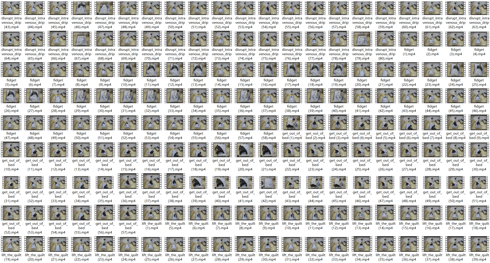

# Nurse-Net
​      

​                         

​                         

The repo contains the ICUAction-8 dataset proposed in Nerse-Net and the corresponding demo clips. 

ICUAction-8 was collected using Hikvision DS-2CD2383G0-I network cameras in two real ICU wards under the guidance of a doctor. The camera is fixed to the ceiling at the end of the bed. It consists of 556 video clips obtained from 7 unique volunteers with 8 video action labels. The data are available to the research community under specific terms of use. Researchers can obtain terms of use by contacting the author of this paper by email, our corresponding email is lvjinrong.23@gmail.com. Email content must contain the following information:
- The researcher needs to contact  us by institution’s email.
- The researcher needs to explain to us the purpose of the dataset in detail.

